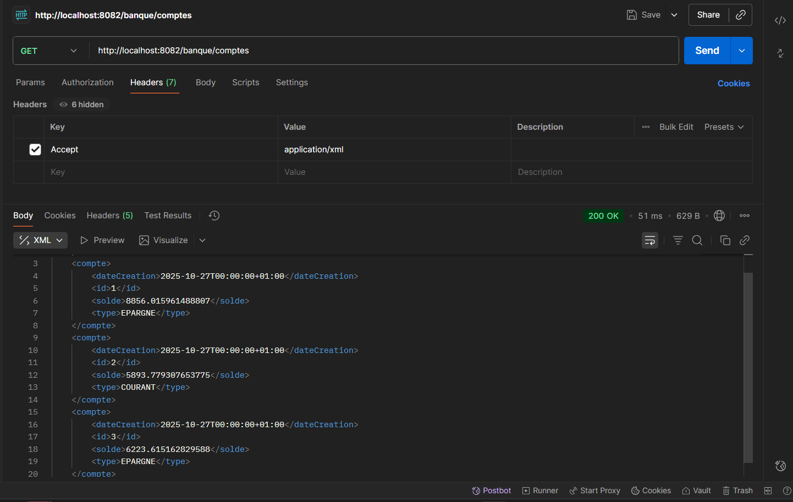
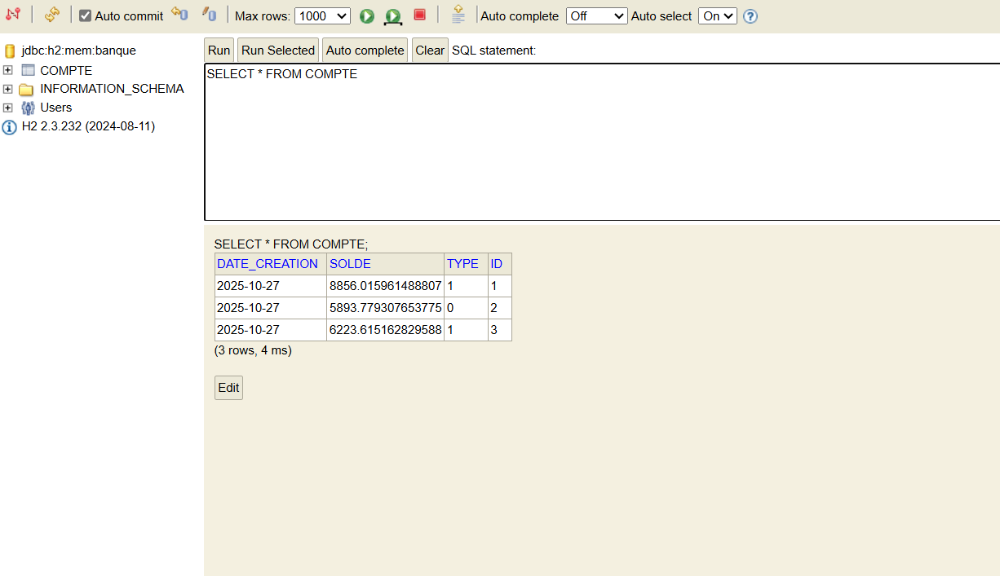

# 📚 Student Management System


Un système de gestion des étudiants développé avec Spring Boot et MySQL, offrant une API RESTful complète pour gérer les informations des étudiants.

## 📋 Table des matières

- [Fonctionnalités](#-fonctionnalités)
- [Technologies utilisées](#-technologies-utilisées)
- [Prérequis](#-prérequis)
- [Installation](#-installation)
- [Configuration](#-configuration)
- [Utilisation](#-utilisation)
- [API Endpoints](#-api-endpoints)
- [Documentation API](#-documentation-api)
- [Tests](#-tests)
- [Démonstration](#-démonstration)
- [Structure du projet](#-structure-du-projet)
- [Auteur](#-auteur)

## ✨ Fonctionnalités

- ➕ Créer un nouvel étudiant
- 📖 Lire la liste de tous les étudiants
- 🗑️ Supprimer un étudiant
- 📊 Compter le nombre total d'étudiants
- 📅 Statistiques des étudiants par année de naissance
- 📝 Documentation API interactive avec Swagger

## 🛠️ Technologies utilisées

- **Backend Framework**: Spring Boot 3.5.7
- **Base de données**: MySQL
- **ORM**: Spring Data JPA / Hibernate
- **Build Tool**: Maven
- **Documentation API**: SpringDoc OpenAPI (Swagger)
- **Tests**: JUnit 5, Mockito
- **Version Java**: 17

## 📦 Prérequis

Avant de commencer, assurez-vous d'avoir installé :

- ☕ Java JDK 17 ou supérieur
- 🗄️ MySQL 8.0 ou supérieur
- 📦 Maven 3.9+ (ou utilisez le wrapper Maven inclus)
- 🔧 Git

## 🚀 Installation

1. **Cloner le repository**
```bash
git clone <url-du-repository>
cd student-management
```

2. **Créer la base de données MySQL**
```sql
CREATE DATABASE studentdb;
```

3. **Configurer la base de données**

Modifiez le fichier [`src/main/resources/application.properties`](src/main/resources/application.properties) avec vos informations de connexion :

```properties
spring.datasource.url=jdbc:mysql://localhost:3306/studentdb?serverTimezone=UTC
spring.datasource.username=votre_username
spring.datasource.password=votre_password
```

4. **Compiler le projet**
```bash
./mvnw clean install
```

Ou sur Windows :
```cmd
mvnw.cmd clean install
```

## ⚙️ Configuration

Le fichier de configuration principal se trouve dans [`src/main/resources/application.properties`](src/main/resources/application.properties) :

```properties
# Nom de l'application
spring.application.name=student-management

# Configuration de la base de données
spring.datasource.url=jdbc:mysql://localhost:3306/studentdb?serverTimezone=UTC
spring.datasource.username=root
spring.datasource.password=

# Configuration JPA/Hibernate
spring.jpa.show-sql=true
spring.jpa.properties.hibernate.format_sql=true
spring.jpa.hibernate.ddl-auto=update
```

## 💻 Utilisation

### Démarrer l'application

```bash
./mvnw spring-boot:run
```

Ou sur Windows :
```cmd
mvnw.cmd spring-boot:run
```

L'application sera accessible sur `http://localhost:8080`

## 🔌 API Endpoints

| Méthode | Endpoint | Description |
|---------|----------|-------------|
| `POST` | `/students/save` | Créer un nouvel étudiant |
| `GET` | `/students/all` | Récupérer tous les étudiants |
| `DELETE` | `/students/delete/{id}` | Supprimer un étudiant par ID |
| `GET` | `/students/count` | Compter le nombre total d'étudiants |
| `GET` | `/students/byYear` | Récupérer le nombre d'étudiants par année de naissance |

### Exemples de requêtes

**Créer un étudiant :**
```bash
curl -X POST http://localhost:8080/students/save \
  -H "Content-Type: application/json" \
  -d '{
    "nom": "Dupont",
    "prenom": "Jean",
    "dateNaissance": "2000-05-15"
  }'
```

**Récupérer tous les étudiants :**
```bash
curl http://localhost:8080/students/all
```

**Supprimer un étudiant :**
```bash
curl -X DELETE http://localhost:8080/students/delete/1
```

## 📖 Documentation API

La documentation interactive de l'API est disponible via Swagger UI :

```
http://localhost:8080/swagger-ui.html
```

## 🧪 Tests

Le projet inclut des tests unitaires pour les contrôleurs et services.

### Exécuter les tests

```bash
./mvnw test
```
## 🎬 Démonstration

### Captures d'écran

## 📁 Structure du projet

```
student-management/
├── src/
│   ├── main/
│   │   ├── java/
│   │   │   └── org/example/studentmanagement/
│   │   │       ├── StudentManagementApplication.java
│   │   │       ├── controllers/
│   │   │       │   └── StudentController.java
│   │   │       ├── entity/
│   │   │       │   └── Student.java
│   │   │       ├── repository/
│   │   │       │   └── StudentRepository.java
│   │   │       └── service/
│   │   │           └── StudentService.java
│   │   └── resources/
│   │       └── application.properties
│   └── test/
│       └── java/
│           └── org/example/studentmanagement/
│               ├── StudentManagementApplicationTests.java
│               └── controllers/
│                   └── StudentControllerTest.java
├── pom.xml
├── mvnw
├── mvnw.cmd
└── README.md
```

### Description des composants


GitHub Copilot: # 💰 Bank Account Management System - JAX-RS


Un système de gestion de comptes bancaires développé avec Spring Boot et JAX-RS (Jersey), offrant une API RESTful complète pour gérer les comptes avec support XML et JSON.

## 📋 Table des matières

- Fonctionnalités
- Technologies utilisées
- Prérequis
- Installation
- Configuration
- Utilisation
- API Endpoints
- Formats de données
- Tests
- Démonstration
- Structure du projet
- Auteur

## ✨ Fonctionnalités

- 💳 Créer un nouveau compte bancaire
- 📖 Lire la liste de tous les comptes
- 🔍 Consulter un compte par ID
- ✏️ Mettre à jour un compte existant
- 🗑️ Supprimer un compte
- 📊 Support des types de comptes (Courant, Épargne)
- 📝 API RESTful avec JAX-RS (Jersey)
- 🔄 Support XML et JSON
- 💾 Base de données H2 en mémoire

## 🛠️ Technologies utilisées

- **Backend Framework**: Spring Boot 3.5.7
- **REST API**: JAX-RS (Jersey 3.1.1)
- **Base de données**: H2 Database (In-Memory)
- **ORM**: Spring Data JPA / Hibernate
- **XML Binding**: JAXB 4.0
- **Build Tool**: Maven
- **Utilities**: Lombok
- **Version Java**: 17

## 📦 Prérequis

Avant de commencer, assurez-vous d'avoir installé :

- ☕ Java JDK 17 ou supérieur
- 📦 Maven 3.9+ (ou utilisez le wrapper Maven inclus)
- 🔧 Git

## 🚀 Installation

1. **Cloner le repository**
```bash
git clone <url-du-repository>
cd TP7-JAX-RS
```

2. **Compiler le projet**
```bash
mvn clean install
```

Ou sur Windows :
```cmd
mvn.cmd clean install
```

## ⚙️ Configuration

Le fichier de configuration principal se trouve dans application.properties :

```properties
# Nom de l'application
spring.application.name=TP7-JAX-RS

# Configuration H2 Database
spring.datasource.url=jdbc:h2:mem:bankdb
spring.datasource.driverClassName=org.h2.Driver
spring.datasource.username=sa
spring.datasource.password=

# Configuration JPA/Hibernate
spring.jpa.database-platform=org.hibernate.dialect.H2Dialect
spring.jpa.hibernate.ddl-auto=update
spring.jpa.show-sql=true

# Console H2
spring.h2.console.enabled=true
spring.h2.console.path=/h2-console

# Configuration Jersey
spring.jersey.application-path=/api
```

## 💻 Utilisation

### Démarrer l'application

```bash
mvn spring-boot:run
```

Ou sur Windows :
```cmd
mvn.cmd spring-boot:run
```

L'application sera accessible sur `http://localhost:8080`

### Accéder à la console H2

Pour visualiser la base de données H2 :
```
http://localhost:8080/h2-console
```

**Paramètres de connexion :**
- JDBC URL: `jdbc:h2:mem:bankdb`
- Username: `sa`
- Password: *(laisser vide)*

## 🔌 API Endpoints

| Méthode | Endpoint | Description | Content-Type |
|---------|----------|-------------|--------------|
| `POST` | `/api/banque/comptes` | Créer un nouveau compte | JSON/XML |
| `GET` | `/api/banque/comptes` | Récupérer tous les comptes | JSON/XML |
| `GET` | `/api/banque/comptes/{id}` | Récupérer un compte par ID | JSON/XML |
| `PUT` | `/api/banque/comptes/{id}` | Mettre à jour un compte | JSON/XML |
| `DELETE` | `/api/banque/comptes/{id}` | Supprimer un compte | - |

### Exemples de requêtes

**Créer un compte (JSON) :**
```bash
curl -X POST http://localhost:8080/api/banque/comptes \
  -H "Content-Type: application/json" \
  -H "Accept: application/json" \
  -d '{
    "solde": 15000.50,
    "dateCreation": "2025-10-27",
    "type": "COURANT"
  }'
```

**Créer un compte (XML) :**
```bash
curl -X POST http://localhost:8080/api/banque/comptes \
  -H "Content-Type: application/xml" \
  -H "Accept: application/xml" \
  -d '<compte>
    <solde>25000.00</solde>
    <dateCreation>2025-10-27</dateCreation>
    <type>EPARGNE</type>
  </compte>'
```

**Récupérer tous les comptes (JSON) :**
```bash
curl -X GET http://localhost:8080/api/banque/comptes \
  -H "Accept: application/json"
```

**Récupérer un compte par ID (XML) :**
```bash
curl -X GET http://localhost:8080/api/banque/comptes/1 \
  -H "Accept: application/xml"
```

**Mettre à jour un compte :**
```bash
curl -X PUT http://localhost:8080/api/banque/comptes/1 \
  -H "Content-Type: application/json" \
  -d '{
    "solde": 20000.00,
    "dateCreation": "2025-10-27",
    "type": "EPARGNE"
  }'
```

**Supprimer un compte :**
```bash
curl -X DELETE http://localhost:8080/api/banque/comptes/1
```

## 📊 Formats de données

### JSON Format
```json
{
  "id": 1,
  "solde": 15000.50,
  "dateCreation": "2025-10-27",
  "type": "COURANT"
}
```

### XML Format
```xml
<?xml version="1.0" encoding="UTF-8"?>
<compte>
  <id>1</id>
  <solde>15000.50</solde>
  <dateCreation>2025-10-27</dateCreation>
  <type>COURANT</type>
</compte>
```

### Types de comptes
- `COURANT` : Compte courant
- `EPARGNE` : Compte épargne

## 🧪 Tests

### Exécuter les tests

```bash
mvn test
```

### Tester avec Postman

1. Importez la collection d'API endpoints
2. Testez les différents endpoints avec JSON et XML
3. Vérifiez les réponses et codes de statut HTTP

## 🎬 Démonstration

### Captures d'écran

*(Section vide - À compléter avec vos captures d'écran)*

#### 1. Liste des comptes

#### 2. Consultation H2 Database



## 📁 Structure du projet

```
TP7-JAX-RS/
├── src/
│   ├── main/
│   │   ├── java/
│   │   │   └── org/example/tp7jaxrs/
│   │   │       ├── Tp7JaxRsApplication.java
│   │   │       ├── config/
│   │   │       │   └── MyConfig.java
│   │   │       ├── controllers/
│   │   │       │   └── CompteRestJaxRSAPI.java
│   │   │       ├── entities/
│   │   │       │   ├── Compte.java
│   │   │       │   └── TypeCompte.java
│   │   │       └── repositories/
│   │   │           └── CompteRepository.java
│   │   └── resources/
│   │       └── application.properties
│   └── test/
│       └── java/
│           └── org/example/tp7jaxrs/
├── pom.xml
└── README.md
```

### Description des composants

- **Tp7JaxRsApplication.java** : Classe principale de l'application Spring Boot
- **MyConfig.java** : Configuration JAX-RS/Jersey
- **CompteRestJaxRSAPI.java** : Contrôleur REST avec annotations JAX-RS
- **Compte.java** : Entité JPA représentant un compte bancaire
- **TypeCompte.java** : Énumération des types de comptes
- **CompteRepository.java** : Repository Spring Data JPA pour les opérations CRUD

## 👨‍💻 Auteur

Développé dans le cadre du TP7 - JAX-RS

---

⭐ N'oubliez pas de mettre une étoile si ce projet vous a été utile !